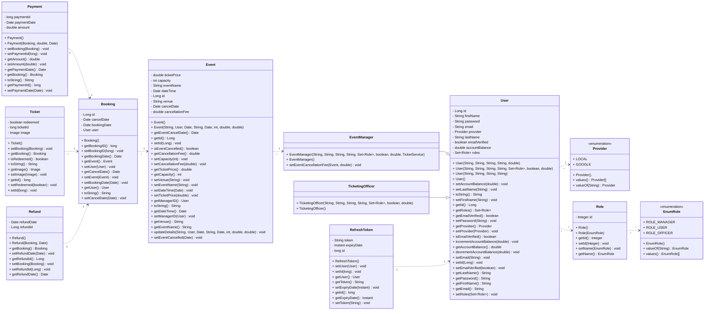

# UML Diagram

```mermaid
classDiagram
direction LR
class Booking {
  + Booking() 
  - Long id
  - Date cancelDate
  - Date bookingDate
  - User user
  + getBookingID() long
  + setBookingID(long) void
  + getBookingDate() Date
  + getEvent() Event
  + setUser(User) void
  + getCancelDate() Date
  + setEvent(Event) void
  + setBookingDate(Date) void
  + getUser() User
  + toString() String
  + setCancelDate(Date) void
}
class EnumRole {
<<enumeration>>
  + EnumRole() 
  +  ROLE_MANAGER
  +  ROLE_USER
  +  ROLE_OFFICER
  + valueOf(String) EnumRole
  + values() EnumRole[]
}
class Event {
  + Event() 
  + Event(String, User, Date, String, Date, int, double, double) 
  - double ticketPrice
  - int capacity
  - String eventName
  - Date dateTime
  - Long id
  - String venue
  - Date cancelDate
  - double cancellationFee
  + getEventCancelDate() Date
  + getId() Long
  + setId(Long) void
  + isEventCancelled() boolean
  + getCancellationFee() double
  + setCapacity(int) void
  + setCancellationFee(double) void
  + getTicketPrice() double
  + getCapacity() int
  + setVenue(String) void
  + setEventName(String) void
  + setDateTime(Date) void
  + setTicketPrice(double) void
  + getManagerID() User
  + toString() String
  + getDateTime() Date
  + setManagerID(User) void
  + getVenue() String
  + getEventName() String
  + updateDetails(String, User, Date, String, Date, int, double, double) void
  + setEventCancelled(Date) void
}
class EventManager {
  + EventManager(String, String, String, String, Set~Role~, boolean, double, TicketService) 
  + EventManager() 
  + setEventCancellationFee(Event, double) void
}
class Payment {
  + Payment() 
  + Payment(Booking, double, Date) 
  - long paymentId
  - Date paymentDate
  - double amount
  + setBooking(Booking) void
  + setPaymentId(long) void
  + getAmount() double
  + setAmount(double) void
  + getPaymentDate() Date
  + getBooking() Booking
  + toString() String
  + getPaymentId() long
  + setPaymentDate(Date) void
}
class Provider {
<<enumeration>>
  + Provider() 
  +  LOCAL
  +  GOOGLE
  + values() Provider[]
  + valueOf(String) Provider
}
class RefreshToken {
  + RefreshToken() 
  - String token
  - Instant expiryDate
  - long id
  + setUser(User) void
  + setId(long) void
  + getUser() User
  + getToken() String
  + setExpiryDate(Instant) void
  + getId() long
  + getExpiryDate() Instant
  + setToken(String) void
}
class Refund {
  + Refund() 
  + Refund(Booking, Date) 
  - Date refundDate
  - Long refundId
  + getBooking() Booking
  + setRefundDate(Date) void
  + getRefundId() Long
  + setBooking(Booking) void
  + setRefundId(Long) void
  + getRefundDate() Date
}
class Role {
  + Role() 
  + Role(EnumRole) 
  - Integer id
  + getId() Integer
  + setId(Integer) void
  + setName(EnumRole) void
  + getName() EnumRole
}
class Ticket {
  + Ticket() 
  - boolean redeemed
  - long ticketId
  - Image image
  + setBooking(Booking) void
  + getBooking() Booking
  + isRedeemed() boolean
  + toString() String
  + getImage() Image
  + setImage(Image) void
  + getId() long
  + setRedeemed(boolean) void
  + setId(long) void
}
class TicketingOfficer {
  + TicketingOfficer(String, String, String, String, Set~Role~, boolean, double) 
  + TicketingOfficer() 
}
class User {
  + User(String, String, String, String, double) 
  + User(String, String, String, String, Set~Role~, boolean, double) 
  + User(String, String, String, String) 
  + User() 
  - Long id
  - String firstName
  - String password
  - String email
  - Provider provider
  - String lastName
  - boolean emailVerified
  - double accountBalance
  - Set~Role~ roles
  + setAccountBalance(double) void
  + setLastName(String) void
  + toString() String
  + setFirstName(String) void
  + getId() Long
  + getRoles() Set~Role~
  + getEmailVerified() boolean
  + setPassword(String) void
  + getProvider() Provider
  + setProvider(Provider) void
  + isEmailVerified() boolean
  + incrementAccountBalance(double) void
  + getAccountBalance() double
  + decrementAccountBalance(double) void
  + setEmail(String) void
  + setId(Long) void
  + setEmailVerified(boolean) void
  + getLastName() String
  + getPassword() String
  + getFirstName() String
  + getEmail() String
  + setRoles(Set~Role~) void
}

EventManager  --|>  User 
TicketingOfficer  --|>  User 
RefreshToken "1" ..> "1" User
User "*" ..> "*" Role
Role "*" ..> "*" EnumRole
Payment "1" ..> "1" Booking
Booking "*" ..> "1" Event
Event "*" ..> "1" EventManager
Ticket "*" ..> "1" Booking
Refund "1" ..> "1" Booking
User "*" ..> "1" Provider
```
